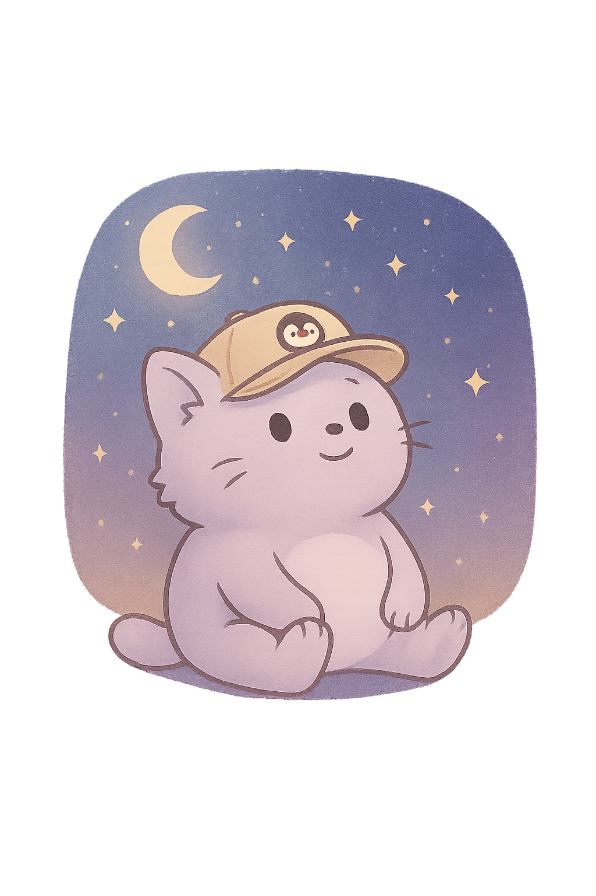

  <h1 align="center">👋 Hi there, I'm Bebrowskiy!</h1>
  <h3 align="center">A passionate developer who loves turning ideas into reality with clean code and a sprinkle of creativity ✨</h3>

  

    
  

  <h2 align="center"> 🧠 About Me </h2>
  

    
    👨‍💻 I'm a versatile developer who loves exploring different technologies and building whatever sparks my curiosity 
    🭠My specialization is <b>having fun while coding</b> - I dive into projects that excite me, whether it's web apps, chatbots, or APIs. 
    💡 I love solving problems and building things that make a difference. 
    🐱 Fun fact: I debug code faster with a cat on my lap!
  

    <!-- Добавим немного пространства -->

  <h2 align="center">🛠️ My Skills</h2>
  

    
    
    
    
    
    
    
    
    
  

  

    
    
    
    
    
  

   

  <h2 align="center"> 🌐 My Portfolio</h2>
  

    
    Check out my <b>interactive portfolio</b> where you can see my projects, skills, and journey as a developer!  
    
  

      <!-- Добавим немного пространства -->

  <h2 align="center"> 📈 My GitHub Stats </h2>
  

    
    
  

   

  <h2 align="center"> 📫 Let's Connect! </h2>
  

    
    
    
    
    
  

   

  

    
     
    <i>Thanks for stopping by! Have a great day! 💖</i>
  

